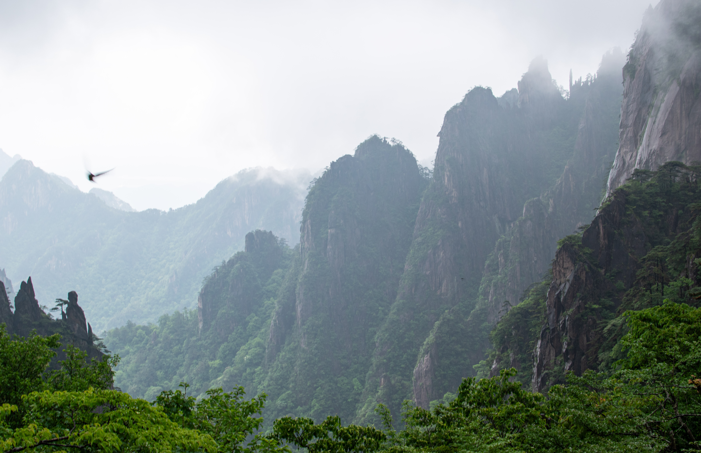
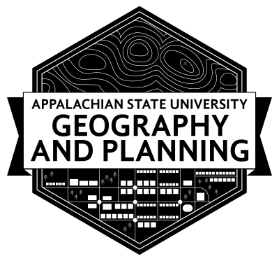

Luke Phelps
=

#### Appalachian State University, Geography and GIS Graduate Student

Expertise
--
Graduate geography and GIS student at Appalachian State University, recently graduating with a B.S. in Geography and a GIS certificate. I am now continuing my education at App State, pursuing a M.A. in Geography with a GIS concentration, with a planned graduation of May 2027.

Education
--
- Bachelor of Science, Geography with a GIS cirtificate, *Appalachian State University*, 2024-2026

- Associate of Arts, *College of the Albemarle*, 2020-2024

Professional Experience
--
- Guest Service Ambassador, H2OBX Waterpark, 2024-2025

- Research Assistant, [*Appalachian State University Geography and Planning Department*](https://geo.appstate.edu), 2026-present

